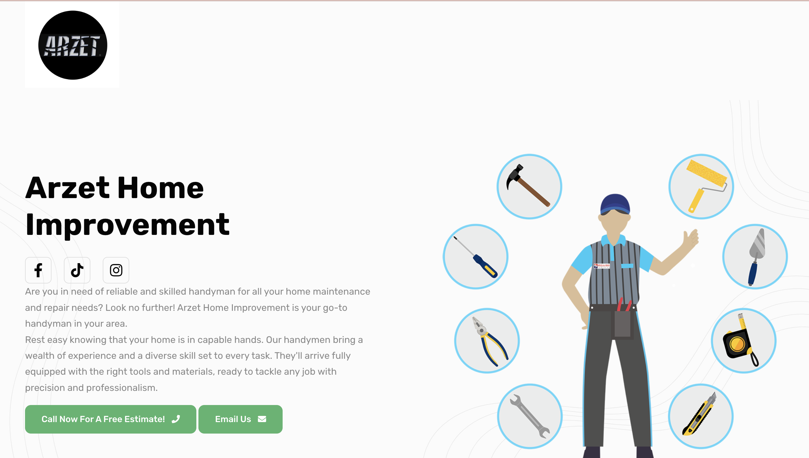
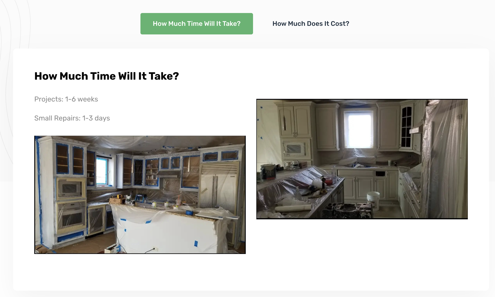
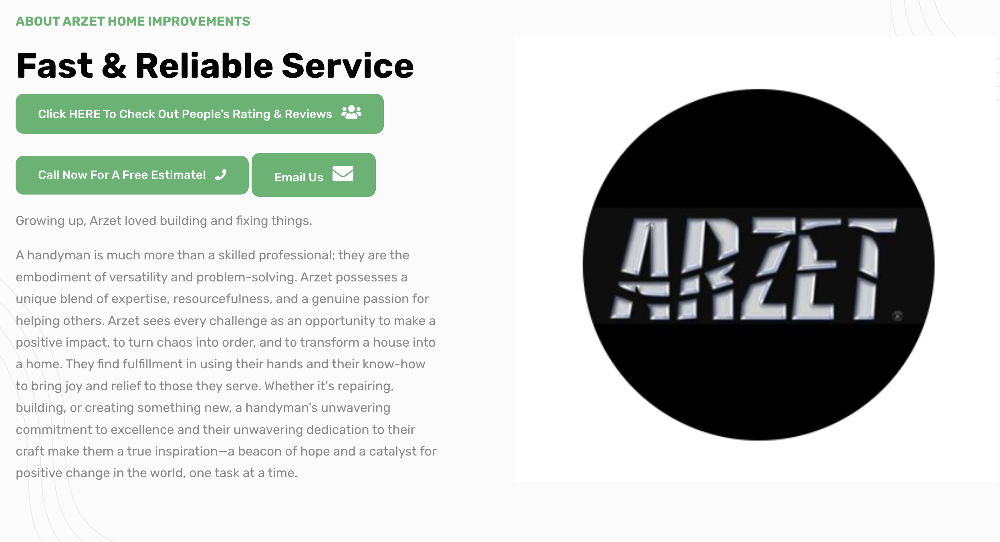
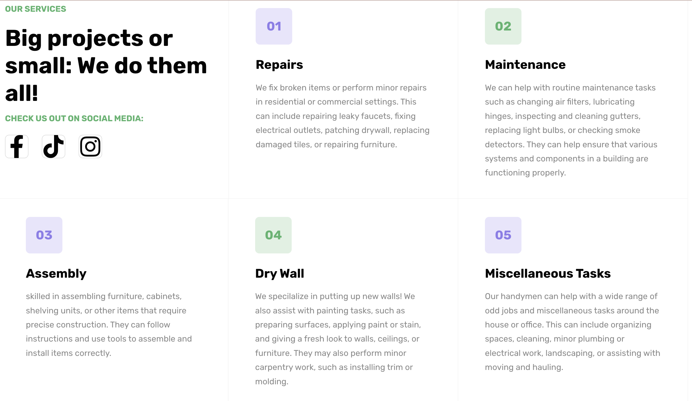

# Arzet Home Improvement 🛠️

[Arzet Home Improvement](https://Arzet-home-improvements.netlify.app/index.html) 🔗

## About

Arzet Home Improvement is locally owned HandyMan service. Small business owner received this website in order to attract mopre clients and expand their brand. Application is designed to let interested people know the type of jobs done, who Arzate Home Improvements i sowned by and be able to contact them via email or call.

## ScreenShots










<!-- download -->

#### Install prerequisites (once for a machine)

- **Node Installation:** [Install node js](https://nodejs.org/en/download/)
- **Gulp Installation:** Install gulp globally from your terminal
  tall

```

- Run locally

```

npm run dev

```
<!-- licence -->

## License

Copyright (c) 2016 -  Developed by Ana Cecy Flores from  [Midwest Development](https://midwestdev.net)

**Code License:** Released under the [MIT](https://github.com/anacecyflores1/arzethomeimprovementLICENSE) license.

**Image license:** The images are only for demonstration purposes. They have their license, we don't have permission to share those images.
```
